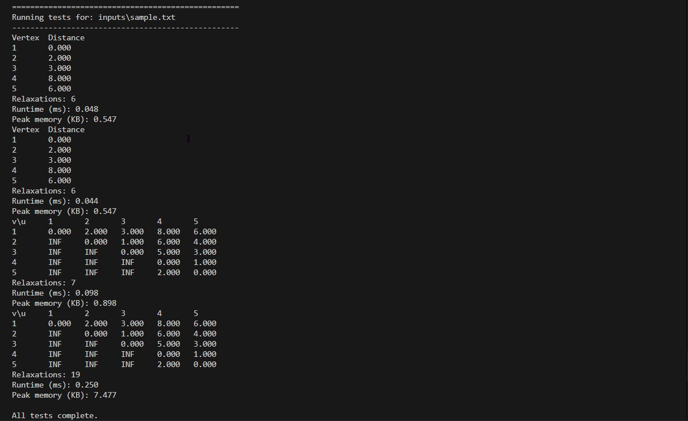
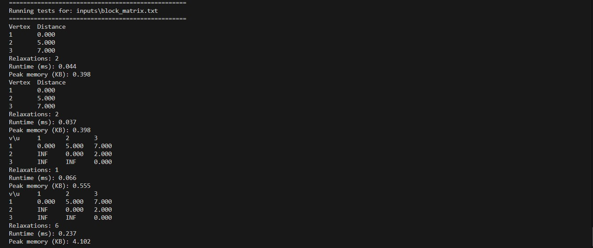
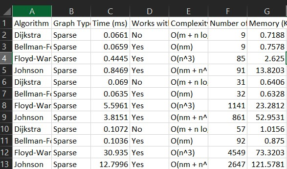
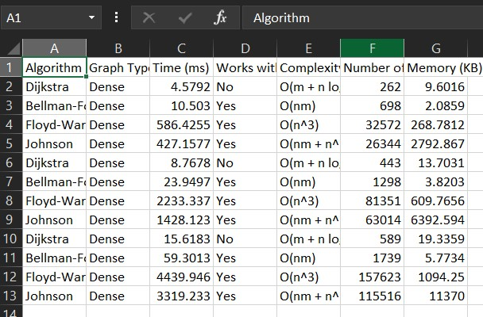
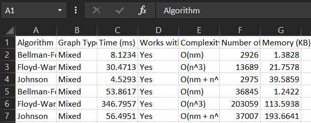

# Johnson & Friends — Classical Shortest-Path Algorithms

A simple, well-documented implementation of classical shortest-path algorithms (Dijkstra, Bellman-Ford, and Johnson's algorithm) with example runs, experimental results, and a runnable script.

## Overview

This repository implements classical graph shortest-path algorithms and includes an experimental analysis and a runnable script. The primary Python script is `i232520-MuhammadNoor-Algo-Asst3.py`, and supporting materials (results, figures, and a report) are included.

Key goals:
- Implement Dijkstra, Bellman-Ford, and Johnson's algorithm where appropriate
- Run experiments to compare algorithm runtimes and behavior
- Provide a reproducible way to run the code and reproduce reported results
  
# Files
-`i232520-MuhammadNoor-Algo-Asst3.py` — implementation and CLI (`run` / `experiment`).
-`inputs.txt` — sample input (place next to the script or in the parent folder).
-`run_code.bat` — convenience batch (runs under `cmd.exe`).

# Requirements
-csv(For tables)

---

## Features

- Implementations of classical shortest-path algorithms
- A runnable script that executes experiments and generates outputs
- CSV with experimental results (`algos_exp_analysis.csv`)
- Assignment report in PDF (`i232520_MuhammadNoor_A3.pdf`)
- Screenshots and visual outputs stored in `/screenshots`

---

## Repository structure

```
Johnson-And-Friends-Using-Classical-Shortest-Algo/
├── i232520-MuhammadNoor-Algo-Asst3.py    # Main Python implementation & experiment runner
├── algos_exp_analysis.csv                # Experimental results (runtimes, comparisons)
├── i232520_MuhammadNoor_A3.pdf           # Assignment report
├── run_code.bat                           # Windows convenience script to run the main python file
├── inputs/                                # Place input graph files here (if any)
├── screenshots/                           # Place images/screenshots here and reference them in this README
└── README.md                              # This file
```

---

# Quick run
Place`i232520-MuhammadNoor-Algo-Asst3.py` and`inputs.txt` together and run:

```cmd
python i232520-MuhammadNoor-Algo-Asst3.py run --input inputs.txt --algorithm Dijkstra --source 1
python i232520-MuhammadNoor-Algo-Asst3.py run --input inputs\sample.txt --algorithm Dijkstra --source 1

From inside inputs_folder,
python ..\i232520-MuhammadNoor-Algo-Asst3.py run --input sample.txt --algorithm Dijkstra --source 1

```
You can also run the experiment harness to generate performance CSVs. Example:

```cmd
python i232520-MuhammadNoor-Algo-Asst3.py experiment --output algos_exp_analysis.csv --graph-types Sparse --sizes 10 30 50
```
To run the bundled batch from `cmd.exe`:

```cmd
.\run_code.bat
```
From PowerShell you can also run the batch with:

```powershell
.\run_code.bat
```

---

## Inputs

- Add any input graph files (text, CSV, or other formats expected by the script) to the `inputs/` directory.
- Inspect `i232520-MuhammadNoor-Algo-Asst3.py` to see the exact input format and how the script loads files (filenames, delimiters, or parsing rules).

---

## Outputs

- Experimental results are stored in `algos_exp_analysis.csv` (or printed to stdout depending on how the script is implemented).
- Any generated figures, plots, or screenshots should go into the `screenshots/` directory.

---

---

## Adding images and referencing them in this README

Simple vertical list (works everywhere):


*Figure 1 — Testing on Sample Input*


*Figure 2 — Testing on Matrix Input*


*Figure 3 — Testing on Sparse Matrix*


*Figure 4 — Testing on Dense Matrix*


*Figure 5 — Testing on Mixed Matrix*

## Notes
- Inputs and command-line `--source` are 1-indexed.
- Dijkstra will abort on graphs with negative-weight edges; use Bellman-Ford for single-source with negatives.
- Experiments export CSV (`algos_exp_analysis.csv`) by default. There is no required external Excel package for the CSV output.

## Tips
- If you see an error about `--algorithm` choices, pass the algorithm name case-insensitively (e.g. `dijkstra` or `Dijkstra`) — the CLI normalizes inputs.
